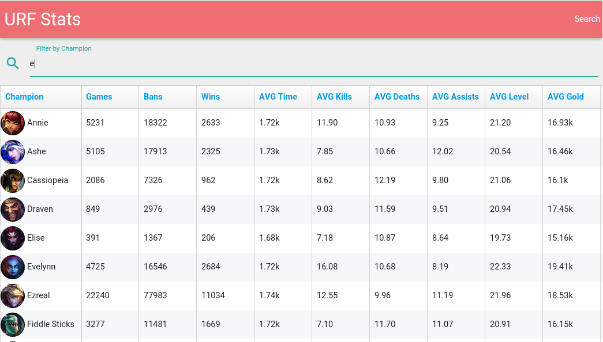

# URF

URF Statistics. ([hzoo/geturf](https://github.com/hzoo/geturf) fetches data)




## Install
- io.js, MySQL 5.6
- Using [webpack/react-starter](https://github.com/webpack/react-starter) (without prerender, flux, etc)
    + react, es6 (babel), socket.io, materialize/normalize.css
```text
# check package.json
npm install
```

## Config
- Create a json file at `lib/config.json` to connect to your database (or local database)
```json
{
    "DB_HOST": "",
    "DB_USER": "",
    "DB_PASSWORD": "",
    "DB_NAME": "",
    "SSL_CA": "a.pem",
    "SSL_CERT": "a.pem",
    "SSL_KEY": "a.pem"
}
```

## Dev Server

``` text
# start the webpack-dev-server in HMR mode
# start the server in dev mode
npm run hot-dev-server && npm run start-dev

# open this url in your browser
http://localhost:8080/
```

## Production compilation and server

``` text
# build the client bundle (createed in `build/`)
# start the server in production mode
npm run build && npm run start

# open this url in your browser
http://localhost:8081/
```

## Code
- All application code is in `app/`
    + `app/simple.html` gets some external files.
    + 
- Server code in `lib/`
    + `lib/query.js` has some of the SQL queries.
    + `lib/server.js` has socket.io code.

#### Stopped using (due to lack of time, knowledge, and frustration)
- Firebase (good for initial test) -> MySQL
- Mongodb - not enough experience -> MySQL -> Cloud SQL
- Flux -> nothing
- jsbin/fiddle (testing) -> a lot of react-hot-loader starter kits -> webpack/react-starter
- [Griddle](https://griddlegriddle.github.io/Griddle/) and many others from http://react.rocks/tag/DataTable -> Fixed-Data-Table (fast, customizable)
