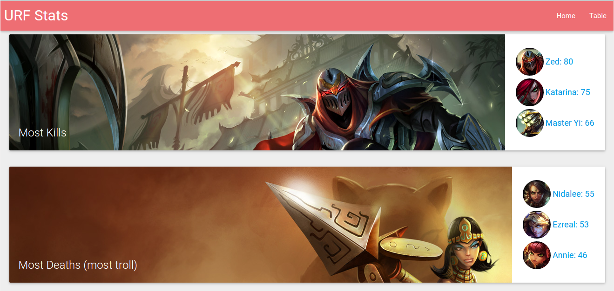

[](https://david-dm.org/hzoo/urf)

[URF Statistics](http://urf.herokuapp.com/) - [hzoo/geturf](https://github.com/hzoo/geturf) fetches data.

> Home



> Table


Shows some top stats as well as a dashboard to look through.


## Install
- [io.js], [MySQL] 5.6 (used [MySQL Workbench] to debug/test)
- Using [webpack/react-starter](https://github.com/webpack/react-starter) (without prerender, flux, etc)
    + [React], [ES6] with [Babel], [socket.io], [materialize.css], [normalize.css]

```text
# Check out the package.json!
npm install
```

## Config
- Create a json file at `lib/config.json` to connect to your database (or local database)
```json
{
    "DB_HOST": "MySQL database host url",
    "DB_USER": "MySQL database username",
    "DB_PASSWORD": "MySQL databse password",
    "DB_NAME": "MySQL database name",
    "SSL_CA": "a.pem",
    "SSL_CERT": "b.pem",
    "SSL_KEY": "c.pem"
}
```

## Running the Dev Server

``` text
# Start the webpack-dev-server in HMR mode
# Start the server in dev mode
npm run hot-dev-server && npm run start-dev

# open this url in your browser
http://localhost:8080/
```

## Running the Production server

``` text
# Build the client bundle (createed in `build/`)
# Start the server in production mode
npm run build && npm run start

# Open this url in your browser
http://localhost:8081/
```

## Code
- All application code is in `app/`
    + `app/simple.html` gets some external files.
- Server code in `lib/`
    + `lib/query.js` has some of the SQL queries.
    + `lib/server.js` has socket.io code.

#### Stopped using (due to lack of time, knowledge, and frustration)
- Firebase (good for initial test) -> MySQL
- Mongodb - not enough experience -> MySQL -> Cloud SQL
- Flux -> nothing
- jsbin/fiddle (testing) -> a lot of react-hot-loader starter kits -> webpack/react-starter
- [Griddle](https://griddlegriddle.github.io/Griddle/) and many others from http://react.rocks/tag/DataTable -> Fixed-Data-Table (fast, customizable)
- Failed on `totalHeal, trueDamageX` since I used a SMALLINT.

[io.js]: https://iojs.org/en/index.html
[MySQL]: https://www.mysql.com/
[React]: https://facebook.github.io/react/
[Babel]: https://babeljs.io/
[ES6]: https://github.com/lukehoban/es6features
[socket.io]: http://socket.io
[materialize.css]: http://materializecss.com/
[normalize.css]: https://necolas.github.io/normalize.css/
[MySQL Workbench]: https://dev.mysql.com/downloads/workbench/
